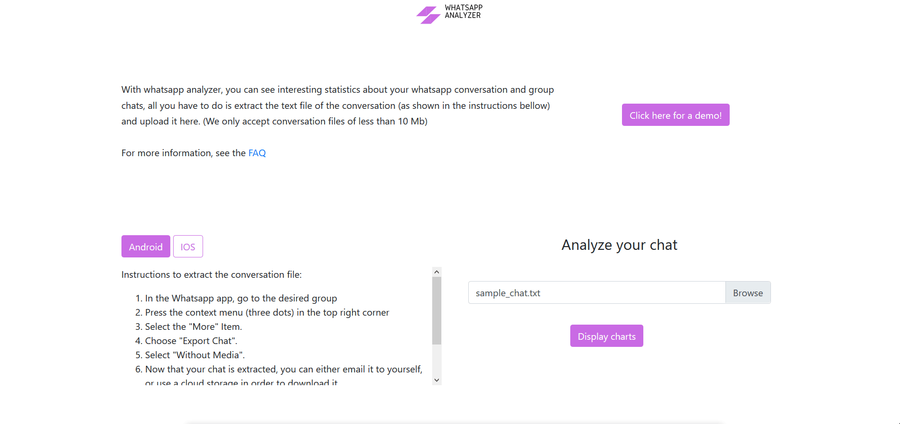

# Whatsapp Analyzer

A Whatsapp chat visualizer built with Flask for the web interface and Pandas to handle the data.

A demo is available at http://whatsappanalyzer.com



## Table of content

- [Project structure](#project-structure)

- [Get started](#get-started)

- [Deployment](#deployment)

## Project structure

```
    /core
        /conf
            __init__.py
            secret_settings_template.py
            secret_settings.py
            settings.py
        __init__.py
        app.py
        utils.py
        views.py
    /static
        /css
        /img
        /js
        /samples
        robots.txt
        sitemap.txt
    /templates
        /errors
            404.html
            405.html
            file_processing_error.py
        analysis.html
        base.html
        faq.html
        index.html
    /uploads
    /venv
    .gitignore
    README.md
    requirements.txt
    wsgi.py
```

## Get started

### Install dependencies

Create a virtual environment with the dependencies:

Go in the root of the folder run: `python -m venv venv` to create the virtual environment.

Activate the virtual environment:

- On Linux: `source venv/bin/activate`

- On windows `venv/Scripts/activate`

Install the dependencies : `pip install -r requirements.txt`

### Create your secret_settings.py

In the folder `core/conf` you need to create a secret_settings.py file and follow the secret_settings_template.py
structure.

To get a SECRET_KEY from python, one of the way to operate it to run the following:

```
import secrets
secrets.token_hex() <-- your SECRET_KEY
```

### Run development server

Make sure your virtual environment is activated with the `(venv)` tag, or whichever name you gave to your virtual
environment.

In the root of the folder run: `python wsgi.py dev`

### Use Docker

Run the following command from the project root to build your images

```bash
$ sudo docker-compose --file .docker/docker-compose.yml --project-directory . build --compress --force-rm
```

After building your images run your container by issuing the following command from the project root

```bash
$ sudo docker-compose --file .docker/docker-compose.yml --project-directory . up --detach --remove-orphans
```

## Deployment

Deployed with the following instructions on [digital ocean](https://www.digitalocean.com/community/tutorials/how-to-serve-flask-applications-with-uswgi-and-nginx-on-ubuntu-18-04)
